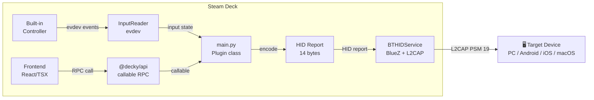

# 🎮 Deck Controller

[](LICENSE)
[](https://decky.xyz)
[](https://store.steampowered.com/steamos)

> **Turn your Steam Deck into a wireless Bluetooth gamepad for any device.**

Ever wanted to use your Steam Deck as a controller for your PC, phone, or TV? Deck Controller makes it happen — no dongles, no adapters, just Bluetooth.

Install the plugin, tap "Start Broadcasting", and pair from any device. Your Steam Deck appears as a standard gamepad — every game and app recognizes it instantly.

<p align="center">
  
  
  
  
  
</p>

---

## ✨ Features

| | Feature | Details |
|---|---------|---------|
| 🎮 | **Full gamepad emulation** | Appears as a standard HID gamepad — Xbox-style, works everywhere |
| 🌍 | **Cross-platform** | Windows, Android, iOS 13+, macOS, Linux |
| ⚡ | **Low latency** | ~10–20 ms end-to-end via direct evdev + L2CAP |
| 🕹️ | **All controls mapped** | Sticks, triggers, d-pad, 16 buttons (including L4, L5, R4) |
| ⚙️ | **Customizable** | Deadzone, polling rate, controller name |
| 📡 | **No extra hardware** | Uses the built-in Bluetooth radio |
| 🔗 | **One-tap pairing** | PIN-less connection — just tap and play |

---

## 🚀 Quick Start

1. Install [DeckyLoader](https://decky.xyz) on your Steam Deck
2. Open Decky menu → Plugin Store → search **"Deck Controller"** → Install
3. Open the plugin → press **Start Broadcasting**
4. On your device: Bluetooth settings → pair with **"Deck Controller"**
5. Play! 🎉

When done, press **Stop Broadcasting** to return to normal.

---

## 🏗️ How It Works



**The pipeline:**

1. **Input capture** — reads raw events from the controller via Linux `evdev`, grabs the device exclusively
2. **HID translation** — packs buttons, sticks, triggers into a 14-byte Xbox-compatible HID report
3. **Bluetooth send** — transmits reports over L2CAP (interrupt channel, PSM 19) to the paired device
4. **Seamless pairing** — NoInputNoOutput agent handles connection without PINs

---

## 📱 Platform Support

| Platform | Status | Notes |
|----------|--------|-------|
| Windows 10/11 | ✅ Works | Recognized as Xbox-style gamepad |
| Android 9+ | ✅ Works | Compatible with games and emulators |
| iOS 13+ | ✅ Works | Apps with GameController framework |
| macOS 11+ | ✅ Works | Native and Steam games |
| Linux | ✅ Works | Standard HID via BlueZ |

---

## 📥 Installation

### From Decky Plugin Store (recommended)

1. Install [DeckyLoader](https://decky.xyz) on your Steam Deck
2. Open the Decky menu (QAM → plug icon)
3. Go to the Plugin Store
4. Search for **"Deck Controller"**
5. Click **Install**

### Manual Install

```bash
ssh deck@steamdeck
git clone https://github.com/daiedy/deck-controller.git /tmp/deck-controller
cd /tmp/deck-controller && make build
cp -r dist defaults assets plugin.json main.py backend \
  ~/homebrew/plugins/deck-controller/
sudo systemctl restart plugin_loader
```

---

## ⚙️ Configuration

All settings are in the plugin's Settings panel (Decky menu → Deck Controller → ⚙️).

| Option | Default | Description |
|--------|---------|-------------|
| Controller Name | `"Deck Controller"` | Bluetooth name shown on other devices |
| Auto Connect | Off | Reconnect to last device automatically |
| Polling Rate | 250 Hz | Input frequency (125 / 250 / 500) |
| Deadzone | 5% | Analog stick dead zone |
| Gyro | Off | Forward gyroscope (experimental) |
| Trackpads | Off | Forward trackpad (experimental) |
| Max Connections | 1 | Simultaneous BT connections |

Config: `~/homebrew/settings/deck-controller/config.json`

---

## ⚠️ Known Limitations

- **One device at a time** — Bluetooth Classic HID supports a single connection
- **BT audio drops briefly** — starting broadcasting restarts `bluetoothd` (reconnects automatically)
- **Gyro & trackpads** — experimental, not yet in the HID report descriptor

---

## 📚 Documentation

| Document | Contents |
|----------|----------|
| [Architecture](docs/ARCHITECTURE.md) | System design, components, data flow |
| [Bluetooth HID](docs/BLUETOOTH.md) | Protocol details, SDP, L2CAP, report descriptor |
| [SteamOS Notes](docs/STEAMOS.md) | Filesystem constraints, bluetoothd, bundling |
| [Development](docs/DEVELOPMENT.md) | Setup, build, deploy, contribute |
| [Wiki](https://github.com/daiedy/deck-controller/wiki) | Full project wiki with guides (syncable via scripts/wiki-sync.sh) |

---

## 📄 License

[BSD-3-Clause](LICENSE) © 2024–2026 daiedy

---

<p align="center">
Built with ❤️ for the Steam Deck community
</p>
