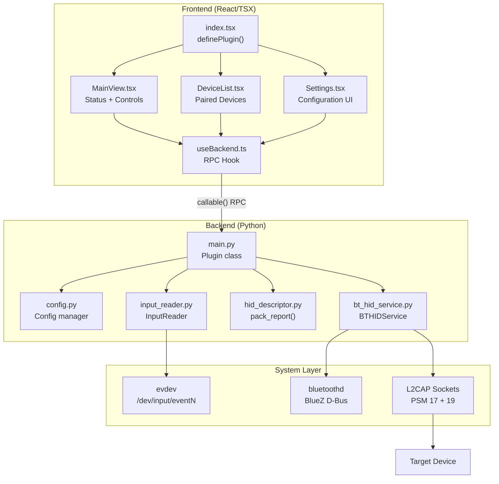
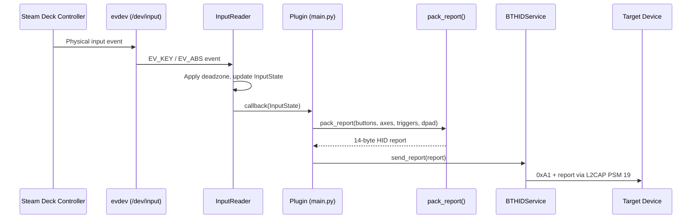
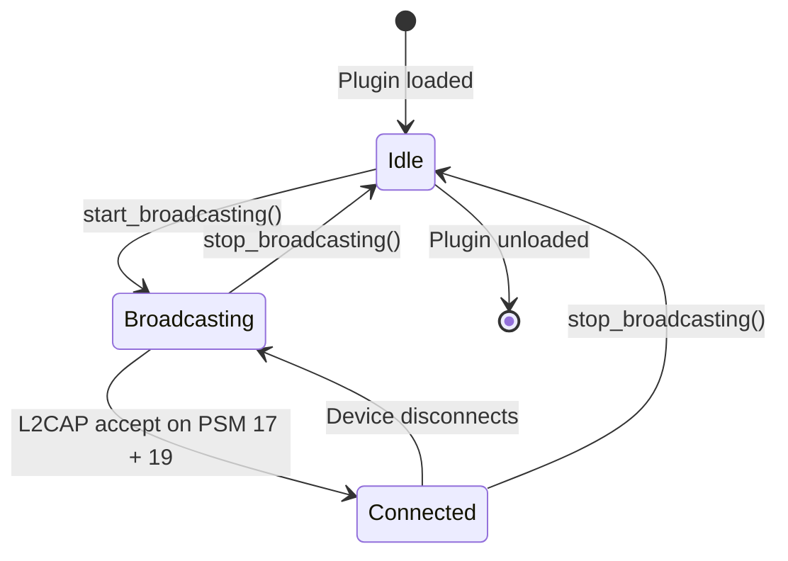

# Architecture

This document describes the system architecture of the Deck Controller plugin.

## System Overview

Deck Controller is structured as a DeckyLoader plugin with two layers:

- **Frontend** — a React/TSX UI rendered inside Steam's Quick Access Menu
- **Backend** — a Python 3.10+ service that reads controller input, encodes HID reports, and transmits them over Bluetooth

The frontend and backend communicate via DeckyLoader's RPC mechanism (`@decky/api` `callable()`).

## Components

### Frontend

| File | Purpose |
|------|---------|
| `src/index.tsx` | Plugin entry point. Calls `definePlugin()` to register the plugin with DeckyLoader, defines the sidebar icon (`FaGamepad`) and title. |
| `src/components/MainView.tsx` | Primary UI. Displays connection state (Idle / Broadcasting / Connected) with color-coded status. Provides Start/Stop Broadcasting button. |
| `src/components/DeviceList.tsx` | Lists paired Bluetooth devices with address and name. Provides Refresh and Remove controls. |
| `src/components/Settings.tsx` | Configuration panel. Exposes controller name, auto-connect toggle, polling rate dropdown, deadzone slider, gyro/trackpad toggles, and max connections. |
| `src/hooks/useBackend.ts` | Custom React hook wrapping all backend RPC calls. Uses `callable()` from `@decky/api` to invoke Python methods. Manages status polling on a 2-second interval. |

### Backend

| File | Purpose |
|------|---------|
| `main.py` | `Plugin` class — DeckyLoader lifecycle (`_main`, `_unload`, `_uninstall`). Exposes RPC methods: `start_broadcasting`, `stop_broadcasting`, `get_status`, `get_devices`, `set_config`, `get_config`. Wires InputReader → pack_report → BTHIDService. |
| `backend/config.py` | `Config` class — thread-safe JSON config manager. Loads `defaults/defaults.json`, merges with user settings at `~/homebrew/settings/deck-controller/config.json`. All access protected by `threading.Lock`. |
| `backend/input_reader.py` | `InputReader` class — finds the Steam Deck controller via evdev device name matching (`"Microsoft X-Box 360 pad"`, `"Steam Deck"`, `"Valve Software Steam Controller"`). Grabs the device exclusively, reads events asynchronously, normalizes axes with configurable deadzone, maps buttons to a 16-bit bitmask, converts hat switch values from `ABS_HAT0X`/`ABS_HAT0Y` pairs. |
| `backend/hid_descriptor.py` | Composite HID Report Descriptor (`COMPOSITE_REPORT_DESCRIPTOR`) and packing helpers. Contains three report IDs: 1 = gamepad (up to 20 buttons, 4 × int16 axes, 2 × uint8 triggers, hat), 2 = mouse (relative X/Y + wheel), 3 = motion (6 × int16 for gyro + accel). The gamepad report packaged by `pack_report()` is 15 bytes: Report ID (1) + 3 bytes buttons + 4×int16 axes + 2×uint8 triggers + 1 byte d-pad. |
| `backend/bt_hid_service.py` | `BTHIDService` class — manages the full Bluetooth lifecycle: restarts `bluetoothd` with `-P input`, sets device class to `0x002508` (gamepad), configures adapter properties via `bluetoothctl`, registers SDP service record, opens L2CAP sockets on PSM 17/19, accepts connections, sends HID reports, and restores `bluetoothd` on shutdown. |

## Data Flow

### Report Structure (15 bytes)

| Offset | Size | Field | Range |
|--------|------|-------|-------|
| 0 | 1 byte | Report ID | `0x01` |
| 1–3 | 3 bytes | Buttons | 20-bit bitmask (little-endian across 3 bytes) |
| 4–5 | 2 bytes | Left Stick X | −32768 to 32767 (int16 LE) |
| 6–7 | 2 bytes | Left Stick Y | −32768 to 32767 (int16 LE) |
| 8–9 | 2 bytes | Right Stick X | −32768 to 32767 (int16 LE) |
| 10–11 | 2 bytes | Right Stick Y | −32768 to 32767 (int16 LE) |
| 12 | 1 byte | L2 Trigger | 0–255 (uint8) |
| 13 | 1 byte | R2 Trigger | 0–255 (uint8) |
| 14 | 1 byte | D-pad (lower nibble) | 0–7 direction, `0x0F` neutral |

## Technology Stack

| Layer | Technology | Justification |
|-------|-----------|---------------|
| Input capture | `evdev` (python-evdev) | Direct kernel-level input with exclusive grab support; lowest latency path to controller events on Linux |
| HID encoding | `struct.pack` | Zero-dependency binary packing; report descriptor is a static byte array compiled from USB HID spec |
| Bluetooth | BlueZ via `bluetoothctl`/`hciconfig` CLI + raw `AF_BLUETOOTH` sockets | BlueZ is the only BT stack on SteamOS; CLI tools avoid heavy D-Bus library dependencies |
| L2CAP transport | `socket.AF_BLUETOOTH`, `SOCK_SEQPACKET`, `BTPROTO_L2CAP` | Python stdlib; reliable sequenced packets on PSM 17 (control) and PSM 19 (interrupt) |
| Frontend framework | React 18 + TypeScript | Required by DeckyLoader's `@decky/ui` component library |
| Build system | Rollup + pnpm (frontend), direct Python execution (backend) | DeckyLoader convention; no Python build step needed since DeckyLoader runs `.py` files directly |

## BlueZ Integration

The plugin interacts with BlueZ through multiple interfaces:

1. **`bluetoothd` process management** — stopped via `systemctl stop bluetooth`, restarted with `/usr/lib/bluetooth/bluetoothd -P input --nodetach` to disable the built-in input plugin that would conflict with HID device emulation.

2. **Adapter configuration** — `bluetoothctl` commands set the adapter alias, discoverable mode, pairable mode, and discoverable timeout. `hciconfig` sets the Bluetooth device class to `0x002508` (gamepad).

3. **SDP service record** — `assets/gamepad_sdp.xml` defines the HID service with L2CAP PSM 17 (control) and PSM 19 (interrupt), device subclass gamepad, and HID parser version 1.1.1. Registered via `sdptool`.

4. **Pairing agent** — registered as `NoInputNoOutput` capability via `bluetoothctl agent` for PIN-less pairing.

5. **L2CAP sockets** — raw Python sockets (`AF_BLUETOOTH`, `SOCK_SEQPACKET`, `BTPROTO_L2CAP`) bound to `BDADDR_ANY` on PSM 17 and 19. Connections are accepted asynchronously via `asyncio.loop.sock_accept()`.

## Threading Model

The plugin uses Python's `asyncio` event loop (provided by DeckyLoader) as the primary concurrency mechanism:

- **RPC handlers** — `async def` coroutines called by DeckyLoader when the frontend invokes `callable()`
- **Connection accept loop** — `asyncio.Task` running `_accept_connections()` that awaits L2CAP socket accepts
- **Input read loop** — `asyncio.Task` running `_read_loop()` that uses `evdev.async_read_loop()` for non-blocking event reads
- **Config persistence** — `threading.Lock` protects the `Config._data` dict since config can be read from the async context and written from any thread

No additional OS threads are spawned. The `evdev` async reader and socket operations all run on the single asyncio event loop.

## State Machine

| State | `_running` | `_connected_device` | Behavior |
|-------|-----------|---------------------|----------|
| Idle | `False` | `None` | Normal Steam Deck operation; bluetoothd running in default config |
| Broadcasting | `True` | `None` | bluetoothd restarted with `-P input`; adapter discoverable; L2CAP listening; evdev grabbed |
| Connected | `True` | `ConnectionInfo(...)` | HID reports sent on every input state change; adapter remains discoverable |

## Security Model

- **Root privileges** — the plugin runs with root access (set via `"flags": ["root"]` in `plugin.json`). Required for `EVIOCGRAB`, `hciconfig`, `systemctl`, and binding L2CAP sockets on privileged PSM ports (<1024).
- **EVIOCGRAB** — the controller device is grabbed exclusively to prevent input events from reaching Steam while broadcasting. Released on stop.
- **Bluetooth pairing** — uses `NoInputNoOutput` agent capability (no PIN exchange). This prioritizes ease of use over pairing security. The BT device class and SDP record identify the device as a gamepad, reducing social engineering risk.
- **No network access** — the plugin does not make any HTTP/internet requests. All communication is local Bluetooth.

## Future Considerations

- **Rust HID daemon** — replacing the Python input→HID→L2CAP path with a Rust binary could reduce latency by eliminating GIL contention and Python's asyncio overhead. The Rust daemon would read evdev, pack reports, and write to L2CAP sockets in a single tight loop.
- **BLE HID** — Bluetooth Low Energy HID over GATT would enable connections to more devices without Classic BT pairing, but iOS GameController framework support for BLE HID gamepads is limited.
- **Multi-connection** — supporting multiple simultaneous connections would require multiplexing HID reports across separate L2CAP socket pairs, plus managing multiple accept loops.
