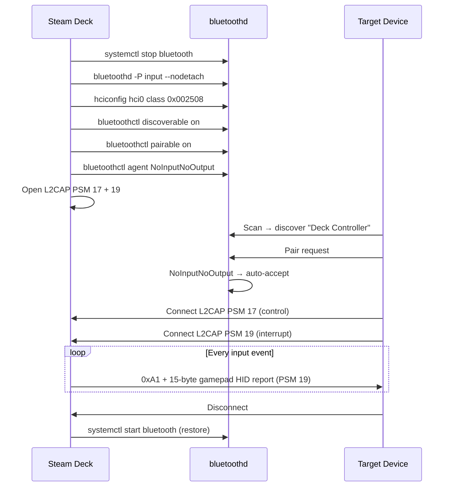

# Bluetooth HID Protocol Reference

This document covers the Bluetooth HID profile implementation used by Deck Controller.

## Bluetooth HID Profile Overview

The Bluetooth Human Interface Device (HID) profile allows a peripheral to send input reports to a host. Deck Controller implements the **HID Device** role, making the Steam Deck appear as a standard Bluetooth gamepad to any host.

Key characteristics:

- **Profile**: HID (UUID `0x1124`) over Bluetooth Classic (BR/EDR)
- **Transport**: L2CAP (Logical Link Control and Adaptation Protocol)
- **Channels**: two fixed PSM (Protocol/Service Multiplexer) channels — control and interrupt
- **Device class**: `0x002508` — Peripheral / Gamepad subclass
- **Pairing**: `NoInputNoOutput` (no PIN required)

## SDP Service Record

The SDP (Service Discovery Protocol) record advertises the HID service to scanning hosts. It is defined in `assets/gamepad_sdp.xml` and registered via `sdptool`.

### Key SDP Attributes

| Attribute ID | Name | Value | Purpose |
|-------------|------|-------|---------|
| `0x0001` | Service Class ID List | `0x1124` (HID) | Identifies this as an HID service |
| `0x0004` | Protocol Descriptor List | L2CAP → PSM 17, HIDP | Control channel |
| `0x0009` | Profile Descriptor List | HID v1.1 | HID profile version |
| `0x000D` | Additional Protocol Descriptor | L2CAP → PSM 19, HIDP | Interrupt channel |
| `0x0100` | Service Name | `"Deck Controller"` | Human-readable name |
| `0x0101` | Service Description | `"Bluetooth HID Gamepad"` | Device description |
| `0x0102` | Service Provider | `"daiedy"` | Author |
| `0x0201` | HID Parser Version | `0x0111` (1.1.1) | Parser compatibility |
| `0x0202` | HID Device Subclass | `0x08` (Gamepad) | Gamepad subclass |
| `0x0204` | HID Virtual Cable | `true` | Supports virtual cable reconnect |
| `0x0205` | HID Reconnect Initiate | `true` | Device can initiate reconnection |

## L2CAP Channels

L2CAP provides reliable, sequenced data delivery over Bluetooth. HID uses two fixed channels:

### Control Channel (PSM 17)

- **Purpose**: HID protocol control messages (SET_REPORT, GET_REPORT, SET_PROTOCOL)
- **PSM**: 17 (`0x0011`)
- **Socket type**: `SOCK_SEQPACKET` over `AF_BLUETOOTH` with `BTPROTO_L2CAP`
- **Usage in Deck Controller**: accepted during connection setup; not actively used for data in typical gamepad operation

### Interrupt Channel (PSM 19)

- **Purpose**: HID input reports (gamepad state data)
- **PSM**: 19 (`0x0013`)
- **Socket type**: `SOCK_SEQPACKET` over `AF_BLUETOOTH` with `BTPROTO_L2CAP`
- **Usage in Deck Controller**: all HID reports are sent on this channel with a `0xA1` header byte (DATA | INPUT)

### Socket Setup (from `bt_hid_service.py`)

```python
# Control channel
control_socket = socket.socket(socket.AF_BLUETOOTH, socket.SOCK_SEQPACKET, BTPROTO_L2CAP)
control_socket.setsockopt(socket.SOL_SOCKET, socket.SO_REUSEADDR, 1)
control_socket.bind((socket.BDADDR_ANY, 17))  # PSM 17
control_socket.listen(1)

# Interrupt channel
interrupt_socket = socket.socket(socket.AF_BLUETOOTH, socket.SOCK_SEQPACKET, BTPROTO_L2CAP)
interrupt_socket.setsockopt(socket.SOL_SOCKET, socket.SO_REUSEADDR, 1)
interrupt_socket.bind((socket.BDADDR_ANY, 19))  # PSM 19
interrupt_socket.listen(1)
```

Both sockets are set to non-blocking mode and accepted via `asyncio.loop.sock_accept()`.

## HID Report Descriptor

The HID Report Descriptor defines the structure of input reports sent to the host. It is a binary blob parsed by the host's HID driver. Deck Controller exposes a composite HID report descriptor in `backend/hid_descriptor.py` (`COMPOSITE_REPORT_DESCRIPTOR`) containing three report IDs: 1 = gamepad, 2 = mouse, 3 = motion.

### Descriptor Breakdown

```
Usage Page (Generic Desktop)        — 0x05, 0x01
Usage (Gamepad)                     — 0x09, 0x05
Collection (Application)            — 0xA1, 0x01
  Report ID (1)                     — 0x85, 0x01

  ┌─ 16 Buttons ─────────────────────────────────────┐
  │ Usage Page (Button)             — 0x05, 0x09      │
  │ Usage Min (1), Max (16)         — 0x19..0x29      │
  │ Logical Min (0), Max (1)        — 0x15..0x25      │
  │ Report Size (1), Count (16)     — 0x75..0x95      │
  │ Input (Data, Var, Abs)          — 0x81, 0x02      │
  └───────────────────────────────────────────────────┘

  ┌─ 4 Axes (Left X/Y, Right X/Y) ───────────────────┐
  │ Usage Page (Generic Desktop)    — 0x05, 0x01      │
  │ Usage: X, Y, Z, Rz             — 0x09, 0x30..35  │
  │ Logical Min (−32768)            — 0x16, 0x00,0x80 │
  │ Logical Max (32767)             — 0x26, 0xFF,0x7F │
  │ Report Size (16), Count (4)     — 0x75..0x95      │
  │ Input (Data, Var, Abs)          — 0x81, 0x02      │
  └───────────────────────────────────────────────────┘

  ┌─ 2 Triggers (L2, R2) ────────────────────────────┐
  │ Usage Page (Simulation Controls)— 0x05, 0x02      │
  │ Usage: Brake (L2), Accel (R2)   — 0x09, 0xC5/C4  │
  │ Logical Min (0), Max (255)      — 0x15..0x26      │
  │ Report Size (8), Count (2)      — 0x75..0x95      │
  │ Input (Data, Var, Abs)          — 0x81, 0x02      │
  └───────────────────────────────────────────────────┘

  ┌─ D-pad (Hat Switch) ─────────────────────────────┐
  │ Usage (Hat Switch)              — 0x09, 0x39      │
  │ Logical Min (0), Max (7)        — 0x15..0x25      │
  │ Physical Min (0°), Max (315°)   — 0x35..0x46      │
  │ Report Size (4), Count (1)      — 0x75..0x95      │
  │ Input (Data, Var, Abs, Null)    — 0x81, 0x42      │
  │ 4-bit padding                   — 0x81, 0x03      │
  └───────────────────────────────────────────────────┘

End Collection                      — 0xC0
```

### Button Mapping

| Bit | Button | evdev Code |
|-----|--------|-----------|
| 0 | A | `BTN_A` |
| 1 | B | `BTN_B` |
| 2 | X | `BTN_X` |
| 3 | Y | `BTN_Y` |
| 4 | L1 | `BTN_TL` |
| 5 | R1 | `BTN_TR` |
| 6 | L2 (digital) | `BTN_TL2` |
| 7 | R2 (digital) | `BTN_TR2` |
| 8 | Select | `BTN_SELECT` |
| 9 | Start | `BTN_START` |
| 10 | L3 | `BTN_THUMBL` |
| 11 | R3 | `BTN_THUMBR` |
| 12 | Home | `BTN_MODE` |
| 13 | L4 | — (vendor) |
| 14 | L5 | — (vendor) |
| 15 | R4 | — (vendor) |

### D-pad Hat Switch Values

| Value | Direction |
|-------|-----------|
| 0 | Up |
| 1 | Up-Right |
| 2 | Right |
| 3 | Down-Right |
| 4 | Down |
| 5 | Down-Left |
| 6 | Left |
| 7 | Up-Left |
| `0x0F` | Neutral (centered) |

## BlueZ D-Bus API

Deck Controller interacts with BlueZ through command-line tools rather than direct D-Bus bindings. The relevant BlueZ interfaces:

### Adapter (`org.bluez.Adapter1`)

Managed via `bluetoothctl` and `hciconfig`:

| Operation | Command |
|-----------|---------|
| Set name | `bluetoothctl system-alias "Deck Controller"` |
| Enable discovery | `bluetoothctl discoverable on` |
| Enable pairing | `bluetoothctl pairable on` |
| Set timeout | `bluetoothctl discoverable-timeout 0` |
| Set device class | `hciconfig hci0 class 0x002508` |

### Agent (`org.bluez.Agent1`)

Registered as `NoInputNoOutput` capability for PIN-less pairing:

```bash
bluetoothctl agent NoInputNoOutput
bluetoothctl default-agent
```

### ProfileManager (`org.bluez.ProfileManager1`)

Not used directly. SDP registration is handled via `sdptool`.

## Pairing Flow



## Platform Compatibility

### iOS (13+)

iOS supports Bluetooth Classic HID gamepads through the **GameController** framework. Requirements:

- Device class must be `0x002508` (Peripheral / Gamepad)
- SDP record must declare HID service UUID `0x1124`
- Report descriptor must conform to the Extended Gamepad profile (buttons, dual sticks, dual triggers, d-pad)
- `NoInputNoOutput` pairing is supported — iOS auto-pairs without a PIN dialog

Games must adopt the `GCController` API to receive gamepad input. Most modern iOS games support this. The system-level Game Controller settings UI shows paired controllers.

### Android (9+)

Android's Bluetooth HID input stack recognizes standard HID gamepads automatically:

- No app-side changes needed — the system interprets HID reports as `InputDevice` events
- Device class `0x002508` causes Android to display the device as a gamepad
- Works with all apps that use standard `KeyEvent`/`MotionEvent` for gamepad input
- Some Android versions may request pairing confirmation even with `NoInputNoOutput` — this is a one-time dialog

### Windows (10/11)

Windows recognizes the HID report descriptor and maps it to `XInput` or `DirectInput`:

- Appears as a standard gamepad in the "Game Controllers" control panel
- Works with Steam's controller support, Xbox Game Bar, and most PC games
- Windows may install a generic HID gamepad driver on first connection (takes a few seconds)

## Latency Analysis

End-to-end latency from physical button press to host-side event:

| Stage | Typical Latency | Notes |
|-------|----------------|-------|
| Controller hardware → kernel | < 1 ms | USB HID polling interval on the internal bus |
| evdev read (`async_read_loop`) | ~0.5 ms | Async read from `/dev/input/eventN` |
| Deadzone + state update | ~0.01 ms | Bitwise operations and integer comparisons |
| `pack_report()` | ~0.01 ms | `struct.pack` of 14 bytes |
| Python → L2CAP `send()` | ~0.5 ms | Kernel socket buffer copy |
| Bluetooth radio transmission | 5–10 ms | BR/EDR link with adaptive frequency hopping |
| Host HID driver processing | ~1 ms | Varies by OS and driver |
| **Total** | **~7–13 ms** | Imperceptible for most game genres |

The dominant factor is the Bluetooth radio hop. Actual latency depends on RF conditions, host Bluetooth stack implementation, and connection interval negotiation.

## Troubleshooting

### Device not discovered

- Verify `bluetoothd` restarted with `-P input`: check `ps aux | grep bluetoothd`
- Confirm adapter is discoverable: `bluetoothctl show` should list `Discoverable: yes`
- Check device class: `hciconfig hci0` should show class `0x002508`
- Ensure no other application has grabbed the BT adapter

### Pairing fails

- Reset the agent: `bluetoothctl agent off` then `bluetoothctl agent NoInputNoOutput`
- Remove stale pairing on both devices and retry
- On iOS: go to Settings → Bluetooth → tap (i) next to the device → Forget This Device

### Connected but no input

- Verify evdev device is found: check DeckyLoader logs for `"Found controller:"`
- Confirm device is grabbed: `"Grabbed device exclusively"` should appear in logs
- Test L2CAP sockets: the interrupt channel client (`_interrupt_client`) must not be `None`
- Send a test: look for `"Failed to send HID report"` errors in logs

### High latency

- Reduce polling rate from 500 Hz to 250 Hz if the Bluetooth stack is congested
- Move closer to the target device to reduce RF retransmissions
- Check for 2.4 GHz Wi-Fi interference — Bluetooth shares this band

### bluetoothd won't restart

- Check if another process holds a lock: `fuser /var/run/dbus/system_bus_socket`
- Verify the binary exists: `ls -l /usr/lib/bluetooth/bluetoothd`
- Manual restart: `sudo /usr/lib/bluetooth/bluetoothd -P input --nodetach &`
